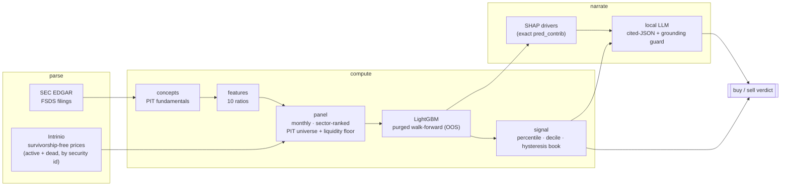
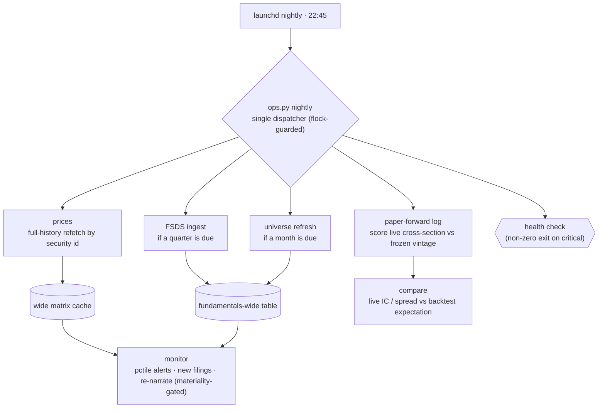

<p align="center">
  
</p>

<h1 align="center">Argus</h1>

<p align="center"><em>survivorship-free · point-in-time · honest by construction</em></p>

**Argus** is a survivorship-free, point-in-time **quantitative equity scanner** for US
stocks: parse SEC EDGAR filings → compute fundamental signals + a walk-forward ML
prediction → emit a backtested, cost-aware **buy/sell** verdict → narrate it with a local
LLM. It runs unattended and answers, per stock, *what the signal is and why*.

The name is the hundred-eyed giant of myth — an all-seeing watcher over the market. Its
terminal UI (`scripts/argus.py`) is a read-mostly, four-view viewer over the same scanner.

**Guiding rule:** every deterministic, auditable number comes from code; the LLM only
writes prose over numbers that already exist. It invents nothing and never sets the verdict.

## How it works

The scan pipeline is three stages — **parse → compute → narrate** — with a backtestable
verdict at the end. Deterministic numbers flow left to right; the LLM only ever reads the
finished packet.



The whole thing then runs **unattended** (Phase 5): a nightly `launchd` job ingests, keeps
the caches fresh, monitors a watchlist, and appends a paper-forward record scored against a
model + thresholds frozen at a registered vintage — the un-overfittable, out-of-sample test.



Full per-phase verdicts, tables, and honest caveats are in [RESULTS.md](RESULTS.md).

## Status

All five build phases are complete and each passed its go/no-go gate. The machinery now runs
unattended per the second diagram above.

**Verdict (Phase-1 on survivorship-free data): _conditional GO_** — a modest, real edge
(walk-forward OOS rank IC **+0.0375**, t 5.6; long-only **+1.48%/yr** net over the
equal-weight universe, survives 2× costs), at the low end of the realistic 0.02–0.05 band —
research-grade validation, not a production-alpha claim.

## Setup

```bash
uv sync --extra dev        # .venv on Python 3.12 + deps
uv sync --extra ui         # add Textual for the argus terminal UI
uv run pytest -q           # 160 tests green (as of Phase 5)
```

Keys go in `.env` (gitignored): `STOCKSCAN_INTRINIO_KEY` and `STOCKSCAN_PRICE_PROVIDER=intrinio`
for survivorship-free prices + the universe. SEC EDGAR needs no key. The data store lives under
`data/` (also gitignored); point at it with `STOCKSCAN_DATA_DIR` if it is not the repo default.

## Use

```bash
# per-ticker analysis (parse → compute → score → narrate), point-in-time as of a date
uv run python scripts/analyze.py AAPL [--as-of 2026-07-01]

# ranked sector/market scan — deterministic table now, LLM narration lazy + cached
uv run python scripts/scan.py

# the argus terminal UI (needs the [ui] extra)
uv run python scripts/argus.py

# unattended operation: one nightly dispatcher (ingest → monitor → paper-forward)
uv run python scripts/ops.py nightly       # or: health | monitor | paper | prices | fsds | universe
uv run python scripts/ops.py install-launchd   # schedule it (macOS, daily 22:45)
```

## Layout

```
src/stockscan/            # the import package (name unchanged; the *project* is Argus)
  config.py               # paths + the locked decisions (DESIGN.md §10)
  pit.py                  # point-in-time guard (assert_pit) — the #1 correctness invariant
  edgar/                  # SEC EDGAR: throttled client, FSDS fundamentals, delistings, tickers
  intrinio_universe.py    # survivorship-free universe (active + dead cos, keyed by security id)
  prices.py  panel.py     # per-column price store + wide close/dollar-volume matrices (+ cache)
  concepts.py  features.py  fundamental_panel.py   # PIT fundamentals → ratios → monthly panel
  sector.py  model.py  validation.py               # sector ranks, LightGBM, purged walk-forward, IC/PBO
  backtest.py             # vectorized long-only backtester (costs, borrow, hysteresis)
  serve.py                # per-ticker serve path (train/serve parity by construction)
  narrate/                # cited-JSON LLM contract + grounding validator + materiality cache
  ops/                    # unattended operation: jobs, monitor, paper-forward, health, state, lock
  tui/                    # the argus terminal UI (Textual)
scripts/                  # runnable entry points (analyze, scan, argus, ops, run_phase{1,3}, …)
tests/                    # 160 tests — start with the PIT guard
data/  artifacts/         # gitignored: raw data, Parquet panel, model artifacts, ops state
```

The full architecture, phased build plan, and locked decisions live in `DESIGN.md` (kept
local, not tracked). Per-phase results and the trading verdict are in [RESULTS.md](RESULTS.md).
